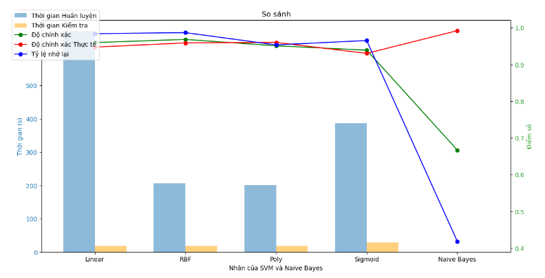

# Intrusion Detection System Using SVM and Naive Bayes

## Project Overview
Dự án này triển khai một Hệ thống Phát hiện Xâm nhập (IDS) sử dụng các thuật toán Hỗ trợ Vector Máy (SVM) với các kernel khác nhau và Naive Bayes. Hệ thống phân tích dữ liệu lưu lượng mạng để phát hiện các xâm nhập và tấn công mạng tiềm năng.

## Dataset
Dự án sử dụng tập dữ liệu KDD Cup 1999, bao gồm các loại xâm nhập mạng khác nhau được mô phỏng trong một môi trường mạng quân sự. Tập dữ liệu chứa:

- **Tập huấn luyện**: 125,973 bản ghi
- **Tập kiểm tra**: 22,544 bản ghi
- **41 đặc trưng mỗi bản ghi**
- **Phân loại nhị phân** (Bình thường vs Tấn công)

## Features
Tập dữ liệu bao gồm các loại đặc trưng:

- **Các đặc trưng cơ bản** (duration, protocol_type, service, v.v.)
- **Các đặc trưng nội dung** (số lần đăng nhập không thành công, trạng thái đăng nhập, v.v.)
- **Các đặc trưng lưu lượng** (count, srv_count, v.v.)
- **Các đặc trưng lưu lượng dựa trên máy chủ** (dst_host_count, dst_host_srv_count, v.v.)

## Implementation Details

### Data Preprocessing
- **Mã hóa đặc trưng**:
  - One-hot encoding cho các đặc trưng phân loại (protocol_type, service, flag)
  - Label encoding cho biến mục tiêu
  - Chuẩn hóa các đặc trưng số

- **Chuyển đổi dữ liệu**:
  - Chuyển đổi từ phân loại sang số
  - Tỷ lệ đặc trưng
  - Phân loại nhị phân

### Models Implemented
- **SVM với các kernel khác nhau**:
  - Linear kernel
  - RBF (Radial Basis Function) kernel
  - Polynomial kernel
  - Sigmoid kernel

- **Naive Bayes (Gaussian)**

## Results
### Performance Metrics

#### SVM - Linear Kernel
- Accuracy: 0.95981 (±0.00430)
- Precision: 0.94743 (±0.00726)
- Recall: 0.98403 (±0.00604)
- F1-score: 0.96537 (±0.00364)
- Training time: 663.504s
- Testing time: 17.906s

#### SVM - RBF Kernel
- Accuracy: 0.96842 (±0.00722)
- Precision: 0.95891 (±0.00982)
- Recall: 0.98683 (±0.00625)
- F1-score: 0.97266 (±0.00618)
- Training time: 206.457s
- Testing time: 18.600s

#### SVM - Polynomial Kernel
- Accuracy: 0.95103 (±0.00651)
- Precision: 0.96023 (±0.00515)
- Recall: 0.95348 (±0.01265)
- F1-score: 0.95683 (±0.00600)
- Training time: 200.826s
- Testing time: 17.949s

#### SVM - Sigmoid Kernel
- Accuracy: 0.93914 (±0.01070)
- Precision: 0.93035 (±0.01158)
- Recall: 0.96540 (±0.01425)
- F1-score: 0.94753 (±0.00932)
- Training time: 387.031s
- Testing time: 28.597s

#### Naive Bayes
- Accuracy: 0.66687 (±0.02374)
- Precision: 0.99223 (±0.00921)
- Recall: 0.41814 (±0.04447)
- F1-score: 0.58795 (±0.04347)
- Training time: 0.320s
- Testing time: 0.034s

### Key Findings
- Kernel RBF cho thấy hiệu suất tổng thể tốt nhất với độ chính xác và F1-score cao nhất.
- Kernel Linear yêu cầu thời gian huấn luyện lâu nhất nhưng hoạt động tốt.
- Naive Bayes cho thấy độ chính xác cao nhất nhưng độ hồi tưởng và độ chính xác thấp nhất.
- Thời gian huấn luyện biến động đáng kể giữa các mô hình (0.32s - 663.5s).

## Dependencies
- Python 3.x
- pandas
- numpy
- scikit-learn
- matplotlib
- time

## Usage
1. Tải và tiền xử lý dữ liệu.
2. Huấn luyện các mô hình.
3. Đánh giá hiệu suất bằng các métrics khác nhau.
4. So sánh kết quả giữa các mô hình khác nhau.

## Future Improvements
- Tối ưu hóa lựa chọn đặc trưng.
- Tuning siêu tham số.
- Triển khai phương pháp ensemble.
- Khả năng phát hiện theo thời gian thực.
- Thêm phân loại đa lớp.

## Contributors
[**Khanh** - An]
